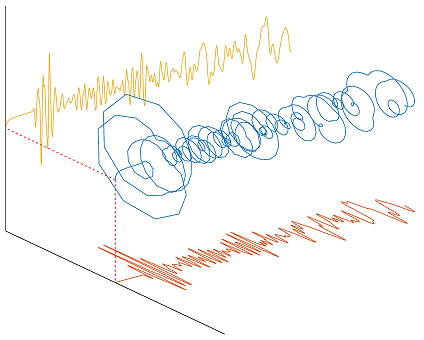

<h1>👋 Hi, I’m Mohammad Bejvani</h1>h1>

<!--   my-icons -->
<p align="center">
    
    &nbsp;
    &nbsp;
    [](https://github.com/BEPb/BEPb) 
    &nbsp;
    &nbsp;  
    &nbsp;
    &nbsp; 
</p>

**- 📫 How to reach me**
<p align="left">
<a href="https://linkedin.com/in/andrej-marinchenko-0445b7214" target="blank"></a>
<a href="mailto:andrej.marinchenko@gmail.com" target="blank"></a>
</p>

   <!--machine-learning-->
```mermaid
graph TD;
    machine-learning-->Data;
    machine-learning-->Algorithms;
    machine-learning-->Statistical-Models;
    machine-learning-->Feature-Engineering;
    machine-learning-->Evaluation-Metrics;
    machine-learning-->Deployment;
   ```
   
<!---
MBejvani/MBejvani is a ✨ special ✨ repository because its `README.md` (this file) appears on your GitHub profile.
You can click the Preview link to take a look at your changes.
--->

## Some coding accomplishments
*	Random and coherent noise suppression of seismic data. (MATLAB)
*	Diverse spectral decomposition methods and seismic attributes. (MATLAB & Python)
*	All conventional stages of seismic data processing. (MATLAB & Seismic Unix)
*	Acoustic and elastic Reverse time migration (RTM) imaging. (MATLAB & Madagascar)
*	2D acoustic and elastic wave propagation simulation in both time and frequency domain using a finite difference scheme. (MATLAB & Madagascar)
*	Acoustic Full-waveform inversion in both time and frequency domain. (MATLAB & Madagascar)

### A sample code
Here is a sample MATLAB code named AnalyticalTrace.m that gives the analytical form of a typical seismic trace. In mathematics and signal processing, an analytic signal is a complex-valued function that has no negative frequency components. The real and imaginary parts of an analytic signal are real-valued functions related to each other by the Hilbert transform. The below figure is a 3D form of an analytical trace with its both real and imaginary parts.


